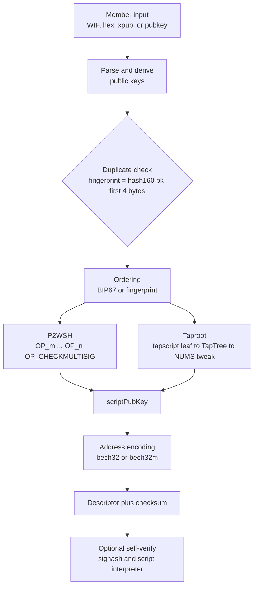

# ₿ Bitcoin Key & Multisig Tools

[](https://www.python.org/downloads/)
[](LICENSE)
[](#-security-model-and-trust-assumptions)
[](#-requirements-and-installation)
[](#running-on-linux-and-macos)
[](#-self-tests-and-official-vectors)

> Two single-file Python tools for Bitcoin key derivation and multisig address construction — P2WSH `m-of-n` and Taproot script-path — that never open a network socket. 🔒
> **They derive and verify. They do not sign or broadcast real transactions.**

| File | Purpose |
| ---- | ------- |
| 🔑 `bitcoin_batch_keys.py` | Single-signer key/address batch generation, import, and inspection (V1) |
| 🏦 `bitcoin_multisig_v2.py` | Multisig address and output descriptor construction, plus a self-verification suite (V2, Bitcoin mainnet only) |

Both run on the Python standard library alone. If `coincurve`, `ecdsa`, `bech32m`, `bech32`, or `base58` happen to be installed they are used as accelerators; otherwise each file falls back to its own built-in implementation. Copy either file anywhere and run it.

> [!CAUTION]
> **Read this before you put real value behind an address from this repository.**
>
> - 🔑 These scripts generate and handle **real private keys**. A bug, a compromised machine, or a careless copy-paste can lose funds permanently.
> - 🚫 **This is not a wallet.** It does not create or read PSBTs, does not look up UTXOs, does not estimate fees, and cannot broadcast. It builds addresses, scripts, and descriptors. Signing real transactions is left to a hardware wallet or a mature wallet.
> - 🔍 **This code has never been audited.** Do not read the self-tests as a security guarantee. Start with a small amount.
> - 📴 **Run it offline.** See [Security Model](#-security-model-and-trust-assumptions) for how to check that claim yourself.

---

## 📑 Table of Contents

- [🔐 Why Multisig?](#-why-multisig)
  - [The single-signature failure mode](#the-single-signature-failure-mode)
  - [What m-of-n actually changes](#what-m-of-n-actually-changes)
  - [What this tool does and does not do](#what-this-tool-does-and-does-not-do)
- [📦 What's in the Box](#-whats-in-the-box)
- [🔒 Security Model and Trust Assumptions](#-security-model-and-trust-assumptions)
  - [No network access, by construction](#no-network-access-by-construction)
  - [Randomness: rejection sampling, no modulo bias](#randomness-rejection-sampling-no-modulo-bias)
  - [Private key lifetime in memory](#private-key-lifetime-in-memory)
  - [Constant-time caveat](#constant-time-caveat)
  - [The NUMS internal key](#the-nums-internal-key)
  - [Non-hardened xpub derivation only](#non-hardened-xpub-derivation-only)
  - [What this tool does NOT do](#what-this-tool-does-not-do)
  - [Practical rules](#practical-rules)
  - [How to verify these claims yourself](#how-to-verify-these-claims-yourself)
- [🧰 Requirements and Installation](#-requirements-and-installation)
  - [Clone the repository](#clone-the-repository)
  - [Python version](#python-version)
  - [Zero required dependencies](#zero-required-dependencies)
  - [Optional accelerators](#optional-accelerators)
  - [Verify which backend is active](#verify-which-backend-is-active)
  - [Deployment and running](#deployment-and-running)
  - [Installing on an air-gapped machine](#installing-on-an-air-gapped-machine)
  - [Running on Linux and macOS](#running-on-linux-and-macos)
- [🚀 Quick Start](#-quick-start)
  - [V1: generate and inspect single-signer keys](#v1-generate-and-inspect-single-signer-keys)
  - [V2: build a 2-of-3 multisig address](#v2-build-a-2-of-3-multisig-address)
- [📖 CLI Reference](#-cli-reference)
  - [bitcoin_batch_keys.py](#bitcoin_batch_keyspy)
  - [bitcoin_multisig_v2.py](#bitcoin_multisig_v2py)
- [🏦 Supported Script Types](#-supported-script-types)
  - [Single-signer types in V1](#single-signer-types-in-v1)
  - [Multisig P2WSH, bc1q, m-of-n](#multisig-p2wsh-bc1q-m-of-n)
  - [Multisig Taproot, bc1p, chain vs tree](#multisig-taproot-bc1p-chain-vs-tree)
  - [Descriptor output](#descriptor-output)
  - [Which one should I use?](#which-one-should-i-use)
- [🔧 How It Works](#-how-it-works)
  - [Pipeline at a glance](#pipeline-at-a-glance)
  - [Step 1: parse and derive](#step-1-parse-and-derive)
  - [Step 2: order the members](#step-2-order-the-members)
  - [Step 3: P2WSH script](#step-3-p2wsh-script)
  - [Step 4: Taproot script](#step-4-taproot-script)
  - [Step 5: address encoding](#step-5-address-encoding)
  - [Step 6: what self-verification actually verifies](#step-6-what-self-verification-actually-verifies)
- [🧭 Walkthroughs](#-walkthroughs)
  - [2-of-3 with keys from this tool](#2-of-3-with-keys-from-this-tool)
  - [3-of-5 with xpubs from existing wallets](#3-of-5-with-xpubs-from-existing-wallets)
  - [Cold storage with hardware wallets](#cold-storage-with-hardware-wallets)
  - [Verify an address before funding it](#verify-an-address-before-funding-it)
- [✅ Self-Tests and Official Vectors](#-self-tests-and-official-vectors)
  - [V1: the 13 checks](#v1-the-13-checks)
  - [V2: the 31 checks](#v2-the-31-checks)
  - [What these self-tests do NOT prove](#what-these-self-tests-do-not-prove)
- [🚧 Known Limitations and Non-Goals](#-known-limitations-and-non-goals)
- [🩺 Troubleshooting](#-troubleshooting)
- [❓ FAQ](#-faq)
- [🚨 Security Disclosure](#-security-disclosure)
- [📜 Disclaimer](#-disclaimer)
- [🤝 Contributing](#-contributing)
- [🙏 Acknowledgements](#-acknowledgements)
- [📚 References](#-references)
- [📄 License](#-license)

---

## 🔐 Why Multisig?

### The single-signature failure mode

A single-signature address has exactly one point of failure: the private key behind it. If that key is stolen — from a malware-free-looking machine, a phishing page, a backup left in cloud storage, or a supply-chain compromise in the software that produced it — **the entire balance is spendable immediately**. There is no cooldown, no second signature, no window in which you notice and react.

Multisig does not make keys unstealable. It makes a single stolen key **insufficient**.

### What m-of-n actually changes

With an `m-of-n` script, fewer than `m` valid signatures cannot satisfy the script. That is a property of the Bitcoin script itself, not of any wallet's policy: the network will not accept the spend. You can watch this happen in `--verify` output, which prints an *expected* result next to the *actual* result, so you can see both "3 of 3 signed, spend succeeds" and "2 of 3 signed, spend correctly refused".

Two things multisig does **not** do:

- It does not protect you from a compromised generator. If the software that produced your public keys was malicious, you handed it the ability to make itself one of your signers.
- It does not protect against a bug in address display. If you misread a character and send to the wrong address, the money is gone regardless of how many keys guard it. **Verify addresses byte by byte before funding them.**

### What this tool does and does not do

| | |
| --- | --- |
| ✅ **Does** | Derive single-signer addresses; build P2WSH `m-of-n` and Taproot script-path multisig addresses; emit output descriptors; cross-check every public key against its private key when one is supplied; replay published BIP test vectors |
| ❌ **Does not** | Sign real transactions, build or parse PSBTs, query the UTXO set, estimate fees, broadcast, or manage a seed phrase |

---

## 📦 What's in the Box

| File | Lines | Purpose | Needs private keys | Network |
| ---- | ----- | ------- | ------------------ | ------- |
| 🔑 `bitcoin_batch_keys.py` | ~1,315 | Batch WIF generation, import, address inspection | Yes, it generates them | mainnet / testnet / regtest |
| 🏦 `bitcoin_multisig_v2.py` | ~3,301 | Multisig address and descriptor construction, self-verification | Only for `--verify` | **mainnet only** |

Each file is standalone. There is no shared module, no package to install, and no configuration file. Copy the one you want.

---

## 🔒 Security Model and Trust Assumptions

### No network access, by construction

Neither file imports `socket`, `urllib`, `requests`, `http`, `subprocess`, or any other transport. The full import list is `argparse`, `ctypes`, `hashlib`, `hmac`, `json`, `os`, `secrets`, `sys`, `time`, `unicodedata`, plus the five optional accelerators. There is no telemetry, no update check, and no phone-home.

This is a statement about the current source, not a guarantee about future versions. Check the file you actually have — see [How to verify these claims yourself](#how-to-verify-these-claims-yourself).

### Randomness: rejection sampling, no modulo bias

Private keys are drawn as a uniform scalar in `[1, n-1]` via `secrets.randbelow(ORDER - 1) + 1`, which is rejection sampling and therefore free of modulo bias. `secrets` reads the operating system CSPRNG (`BCryptGenRandom` on Windows, `getrandom()` on Linux). The `random` module is not used for key material anywhere.

Do not "optimize" this into `random.randrange`. That would replace a cryptographic source with a Mersenne Twister and introduce modulo bias.

### Private key lifetime in memory

Private keys exist as Python `int` and `bytes` objects on the heap. **They are not wiped.** CPython cannot reliably zero a buffer that other objects may still reference, so this code does not attempt it. Consequences you should plan for:

- 🔄 Keys may reach swap or hibernation files.
- 💾 Keys may appear in a crash dump or a core file.
- 🖨️ Keys are printed in full by `gen` and by `--detail`, and appear in JSON and CSV output.
- 📝 Keys are written verbatim to any `-o` file you name.

Run this on a dedicated, air-gapped machine, and clear the output files when you are done with them.

### Constant-time caveat

The built-in ECDSA and Schnorr signing routines are **pure Python and not constant-time**. The source says so itself:

- ⏱️ `ecdsa_sign` — *"Built-in ECDSA signature, dedicated for Self-test (please use a mature wallet or HWI for production environment)."*
- ⏱️ `schnorr_sign` — *"BIP340 Schnorr signature, for self-checking and testing purposes only."*
- ⏱️ `builtin_scalar_multiply` — double-and-add in Jacobian coordinates, which leaks timing information.

Installing `coincurve` **does not** change this. The accelerateable path covers hashing and encoding; signing always uses the built-in implementation. **Do not use this code to sign real transactions.** Use a hardware wallet or a mature wallet for that.

### The NUMS internal key

The Taproot output uses the BIP341 NUMS point, `x = 50929b74...03ac0`, whose discrete logarithm is not known to anyone. This is what makes the key path unspendable and forces every spend through the script path.

The generator point `G` is deliberately **not** used. The discrete logarithm of `G` is `1`, so anyone could derive the tweaked private key themselves and bypass the multisig entirely. The source comments on this at the point of definition.

### Non-hardened xpub derivation only

Extended public keys are accepted only with non-hardened derivation paths. A path containing a hardened step (`'`) is rejected, and the self-tests assert this rejection. See the `Hardened derivations are rejected` case in [V2: the 31 checks](#v2-the-31-checks).

### What this tool does NOT do

Read this list before you choose a workflow. It is the most important section in this file.

- 🧾 **No PSBT.** There is no PSBT parser and no PSBT serializer. `PSBT` appears twice in the source, both times in comments. If your workflow needs a partially signed transaction, this tool cannot produce one.
- 🏗️ **No transaction construction.** `build_test_transaction` creates a synthetic 1-input, 1-output transaction used only by `--verify`. It is never emitted.
- 🌐 **No UTXO lookup, no fee estimation, no broadcast.** The code contains no chain access of any kind, so it cannot know your balance or what a transaction will cost.
- 📇 **No seed phrase support.** Keys are random scalars, not BIP39 mnemonics. There is no wordlist and no mnemonic-to-seed conversion.
- 🔌 **No hardware wallet integration.** No PSBT in means no device workflow out.
- 🚫 **No testnet in V2.** `bitcoin_multisig_v2.py` is mainnet-only and hardcodes mainnet prefixes.

### Practical rules

- 🔐 Treat every generated WIF as spending authority. Keep it on your own machine only.
- 🤝 In a multisig setup, exchange **public keys** or **xpubs**, never private keys. Building an address does not require anyone's private key.
- 🧪 Run `selftest` and `--verify` on a freshly generated address **before** funding it.
- 📁 Generate keys outside any directory under version control. This repository's `.gitignore` covers `__pycache__/`, `*.pyc`, `*.pyo`, and `.DS_Store` — **it does not exclude `keys.txt`, `*.json`, or `*.csv`**, so a file you write here can be committed by accident.
- 💻 On Windows, double-clicking a `.py` file works but gives you no real isolation. Use a machine that is genuinely offline.

### How to verify these claims yourself

```bash
# 1. Confirm no transport module is pulled in
python -c "import bitcoin_multisig_v2, sys; print(sorted(m for m in sys.modules if m in {'socket','ssl','urllib','http','requests','subprocess','ftplib','asyncio'}))"

# 2. Run the self-tests
python bitcoin_batch_keys.py selftest
python bitcoin_multisig_v2.py selftest

# 3. See which acceleration backend is active
python bitcoin_batch_keys.py selftest -v
```

---

## 🧰 Requirements and Installation

### Clone the repository

```bash
git clone https://github.com/wangyifan349/bitcoin-multisig-tools.git
cd bitcoin-multisig-tools
```

With SSH instead of HTTPS:

```bash
git clone git@github.com:wangyifan349/bitcoin-multisig-tools.git
cd bitcoin-multisig-tools
```

> [!NOTE]
> This repository is private. Cloning requires that you have been granted access and that your SSH key or personal access token is configured. If you only need one tool, skip the clone entirely: download the single `.py` file and run it. Each file is self-contained.

### Python version

Python 3.8 or newer. This floor comes from reading the code, not from a CI matrix — neither file asserts `sys.version_info`. The oldest language features actually used are Python 3.7-era (`subparsers(required=True)`, `stream.reconfigure`). If you run an older interpreter, the self-test is the fastest way to find out whether it works.

### Zero required dependencies

Nothing needs to be installed. Both files import their dependencies inside `try/except` blocks and fall back to built-in pure-Python implementations. Download the file, run it.

```bash
python bitcoin_multisig_v2.py selftest
```

### Optional accelerators

These are used automatically when present. Each one is optional.

| Package | Speeds up | Without it |
| ------- | --------- | ---------- |
| `coincurve` (libsecp256k1) | Point multiplication — the dominant cost | Pure-Python double-and-add, correct but much slower |
| `ecdsa` | Curve arithmetic in some paths | Built-in implementation |
| `bech32m` | BIP350 address encoding (SegWit v1) | Built-in implementation |
| `bech32` | BIP173 address encoding (SegWit v0) | Built-in implementation |
| `base58` | Base58Check encoding | Built-in implementation |

Note: the `bech32` package implements BIP173 only. The `bech32m` constant needed for BIP350 is provided internally, so an installed `bech32` still works.

### Verify which backend is active

```bash
python bitcoin_batch_keys.py selftest -v
```

The first output line names each active backend, for example:

```text
Total 13 checks, All checks passed; the program is working correctly.
Curve=coincurve SegWit=bech32m library Base58=base58 library Random=secrets
```

If `Curve` says `builtin`, the pure-Python path is in use. That is fine for correctness; it is slower for large batches.

### Deployment and running

There is nothing to build and no service to start. "Deployment" means copying the single file to the machine that will run it. Three ways:

```bash
# Option A — run directly from the cloned directory
python bitcoin_batch_keys.py selftest
python bitcoin_multisig_v2.py selftest

# Option B — copy one self-contained file to an offline machine, then run it there
scp bitcoin_multisig_v2.py user@offline-host:~/tools/
# on the offline machine:
python ~/tools/bitcoin_multisig_v2.py selftest

# Option C — optional virtual environment (still installs nothing)
python -m venv .venv
# Windows:
.venv\Scripts\activate
# Linux / macOS:
source .venv/bin/activate
python bitcoin_batch_keys.py gen -c 3
```

Smoke test after deployment:

```bash
python bitcoin_batch_keys.py selftest    # expect: Total 13 checks, All checks passed
python bitcoin_multisig_v2.py selftest   # expect: Program OK: 31 checks, all passed.
```

### Installing on an air-gapped machine

You do not need any of the optional packages. If you want one anyway, stage it on a connected machine:

```bash
# On a connected machine
pip download coincurve -d ./wheelhouse
```

Copy `./wheelhouse` to the offline machine, then:

```bash
pip install --no-index --find-links ./wheelhouse coincurve
```

Nothing else is required.

### Running on Linux and macOS

The files have no `.py`-extension requirement, so they can be executed directly after marking them executable:

```bash
chmod +x bitcoin_multisig_v2.py
./bitcoin_multisig_v2.py selftest
```

Double-clicking only applies on Windows.

---

## 🚀 Quick Start

### V1: generate and inspect single-signer keys

Always generate keys on the machine that will hold them, and outside any Git repository.

```bash
# Generate 20 keys and write the WIFs to a file (one per line)
python bitcoin_batch_keys.py gen -c 20 -o keys.txt

# Generate 3 keys and show hex private key, public key, and lock script
python bitcoin_batch_keys.py gen -c 3 -d

# Re-import a file written earlier
python bitcoin_batch_keys.py import -i keys.txt

# Inspect addresses
python bitcoin_batch_keys.py info 1BgGZ9tcN4rm9KBzDn7KprQz87SZ26SAMH

# Run the self-test
python bitcoin_batch_keys.py selftest
```

<details>
<summary>Sample output (private-key columns redacted)</summary>

The `-f line` format, with the two secret columns replaced by `<redacted>`:

```text
Generated 2 keys (Bitcoin mainnet, took 0.00 seconds)
#  WIF        priv_hex    P2PKH                               P2SH-P2WPKH                         P2WPKH (BIP84)                              P2TR (BIP86)
1  <redacted> <redacted>  15BL3vTt2rJ5SRvMPvt6F7VdSDfdAh6vZ7  3DoVehPrnF5sZbvVvsuaS2zDdDtbxPdRmT  bc1q9h2fpv2jq03vw6p7yh7779ql7sp4wdaa9d4c2f  bc1pngkq3m0tk3e40wlmey5r8luypp3gllwxmgm76wskttrsj83y7dasagvra3
2  <redacted> <redacted>  1KrxBZ4nBTMYe5RSyhoEDUabDpwyWemp9a  338UPepZrAtkEXpQ5qPDG7ofqJWqBDq9wD  bc1qemjttddejvmmpl3fsg9zdrrfvtvu6y48rar0p6  bc1p284ltq2s9s48v2jjpa2sn4a6rj597fvhz6pm6k6j8kpjaa60vzqqg7sm9y
```

The `info` sub-command:

```text
address1BgGZ9tcN4rm9KBzDn7KprQz87SZ26SAMH
       P2PKH  bc  base58check
       The general receiving address of the payee's public key (the most common one starting with 1)
```

</details>

Columns: `WIF` is the compressed mainnet private key; `priv_hex` is the same scalar in hex; the four address columns are P2PKH, P2SH-P2WPKH, P2WPKH, and P2TR derived from it.

### V2: build a 2-of-3 multisig address

Each member generates their own keys and shares only the public key. In the example below the three members are the well-known secp256k1 multiples `1G`, `2G`, and `3G`, so you can reproduce every byte.

```bash
# members.txt, one public key per line
# 0279be667ef9dcbbac55a06295ce870b07029bfcdb2dce28d959f2815b16f81798
# 02c6047f9441ed7d6d3045406e95c07cd85c778e4b8cef3ca7abac09b95c709ee5
# 02f9308a019258c31049344f85f89d5229b531c845836f99b08601f113bce036f9

# Build a 2-of-3 bc1q address
python bitcoin_multisig_v2.py build members.txt -t p2wsh -m 2

# The same plan, plus the witness script and both Taproot layouts
python bitcoin_multisig_v2.py build members.txt -t both -m 2 -d

# Add an end-to-end signature check (needs member private keys)
python bitcoin_multisig_v2.py build members.txt -t p2wsh -m 2 --verify
```

<details>
<summary>Sample output (address is deterministic for the keys above)</summary>

```text
================================================================
2-of-3 multi-signature (bc1q, requires the signature of 2 people)
================================================================
  Primary address bc1q bc1qzh7qw48886u9689uuzrcd7kmwvswewxuutu73y
  descriptor   wsh(sortedmulti(2,0279be667ef9dcbbac55a06295ce870b07029bfcdb2dce28d959f2815b16f81798,02c6047f9441ed7d6d3045406e95c07cd85c778e4b8cef3ca7abac09b95c709ee5,02f9308a019258c31049344f85f89d5229b531c845836f99b08601f113bce036f9))#k92q5c46

Members (by BIP67 sorting):
    1. 0279be667ef9dcbbac55a06295ce870b07029bfcdb2dce28d959f2815b16f81798
    2. 02c6047f9441ed7d6d3045406e95c07cd85c778e4b8cef3ca7abac09b95c709ee5
    3. 02f9308a019258c31049344f85f89d5229b531c845836f99b08601f113bce036f9
================================================================
```

With `--verify` and all three private keys present:

```text
================================================================
  End-to-end signature verification
================================================================
  [pass] 1/3 person signature (should fail) 1/3 member signatures: Script judgment failed
  [pass] 2/3 person signature (should pass) 2/3 member signatures: Script judgment passed
================================================================
```

With public keys only, `--verify` reports that it cannot sign and skips:

```text
  [pass] Insufficient member private key, skip Only got 0/2 private keys
```

</details>

Three things to know:

1. `members` is a path, one member per line. Omit it or pass `-` to read from standard input.
2. `--verify` checks the script logic using a synthetic transaction the tool builds for itself — not your real transaction. It only runs for members that supplied a private key.
3. Duplicate members are rejected by 4-byte fingerprint, that is `hash160(pubkey)[:4]`.

---

## 📖 CLI Reference

### bitcoin_batch_keys.py

```text
python bitcoin_batch_keys.py {gen,import,info,selftest} ...
```

`--version` prints `bitcoin_batch_keys 1.1`. Running with no sub-command starts the interactive menu.

#### gen

| Flag | Values | Default | Notes |
| ---- | ------ | ------- | ----- |
| `-c`, `--count` | int | `10` | Number of keys |
| `--no-compression` | flag | off | Emit WIF without the `0x01` compression suffix |
| `-n`, `--network` | `bc`, `btc`, `tb` | `bc` | Address prefix; `btc` is regtest (`bcrt`) |
| `--kinds` | comma list | all four | Subset of `p2pkh,p2sh-p2wpkh,p2wpkh,p2tr` |
| `-f`, `--format` | `block`, `line`, `csv`, `json` | `block` | |
| `-d`, `--detail` | flag | off | Only applies to `-f block` on stdout |
| `-o`, `--out` | path | `-` (stdout) | **Writing to a file emits WIF only**, one per line; `-f` and `-d` are ignored |

#### import

| Flag | Values | Default | Notes |
| ---- | ------ | ------- | ----- |
| `-i`, `--in` | path | — | `-` means stdin; file may end with a terminator line |
| `keys` | positional | — | Additional WIF/hex keys on the command line |
| `--force-compression` | flag | off | Ignore the stored flag, derive compressed addresses |
| `--force-uncompressed` | flag | off | Ignore the stored flag, derive uncompressed addresses |
| `--strict` | flag | off | Exit non-zero if any line fails to parse |
| `-n`, `--network`, `--kinds`, `-f`, `-d`, `-o` | | | Same as `gen` |

WIF import accepts **mainnet version bytes only** (`0x80`). `-n tb` changes the derived address prefix, not the accepted WIF format.

#### info

| Flag | Values | Default | Notes |
| ---- | ------ | ------- | ----- |
| `addresses` | positional | — | One or more addresses |
| `-i`, `--in` | path | — | File of addresses, split on whitespace |
| `-f`, `--format` | `block`, `csv`, `json` | `block` | **No `line` option**, unlike `gen` |
| `-o`, `--out` | path | `-` | |
| `--strict` | flag | off | Exit non-zero on an address that cannot be parsed |

#### selftest

| Flag | Values | Default | Notes |
| ---- | ------ | ------- | ----- |
| `-v`, `--verbose` | flag | off | Print each case and the active backends |

Unlike V2, V1's `selftest` has no `-o` option.

### bitcoin_multisig_v2.py

```text
python bitcoin_multisig_v2 {build,keys,inspect,selftest} ...
```

There is **no `--version` flag**. Identify the version by commit hash. Running with no sub-command starts the interactive menu.

#### build

| Flag | Values | Default | Notes |
| ---- | ------ | ------- | ----- |
| `members` | path | `-` (stdin) | One member per line |
| `-t`, `--type` | `p2wsh`, `p2tr`, `both` | `p2wsh` | |
| `-m`, `--threshold` | int | `min(n, max(2, n//2 + 1))` | **Applies to `bc1q` only** |
| `--order` | `bip67`, `fingerprint` | `bip67` | Public key ordering |
| `--layout` | `chain`, `tree` | `chain` | Taproot structure; see the warning below |
| `-d`, `--detail` | flag | off | Scripts, control blocks, merkle paths |
| `--verify` | flag | off | End-to-end signature check on a synthetic transaction |
| `-f`, `--format` | `block`, `json` | `block` | |
| `-o`, `--out` | path | `-` | |
| `-v`, `--verbose` | flag | off | Backend and itemized results |

Member line formats: WIF, 64-character hex, decimal, 33-byte compressed public key, 65-byte uncompressed public key, `x:` plus a 64-character x-only key, or `xpub.../<path>`.

#### keys

| Flag | Values | Default | Notes |
| ---- | ------ | ------- | ----- |
| `-c`, `--count` | int | `10` | |
| `-f`, `-o`, `-v` | | | Same as `build` |

#### inspect

| Flag | Values | Default | Notes |
| ---- | ------ | ------- | ----- |
| `address` | positional | — | The address to decode |
| `-f`, `-o`, `-v` | | | Same as `build` |

#### selftest

| Flag | Values | Default | Notes |
| ---- | ------ | ------- | ----- |
| `-o`, `--out` | path | `-` | Where to write results |
| `-v`, `--verbose` | flag | off | Show all 31 cases |

---

## 🏦 Supported Script Types

### Single-signer types in V1

| Kind | Address prefix | Standard |
| ---- | -------------- | -------- |
| `p2pkh` | `1...` | Base58 P2PKH |
| `p2sh-p2wpkh` | `3...` | P2SH-wrapped P2WPKH, a single-signer wrapper — **not** P2SH multisig |
| `p2wpkh` | `bc1q...` | [BIP84](https://github.com/bitcoin/bips/blob/master/bip-0084.mediawiki) |
| `p2tr` | `bc1p...` | [BIP86](https://github.com/bitcoin/bips/blob/master/bip-0086.mediawiki) |

### Multisig P2WSH, bc1q, m-of-n

- SegWit v0. The witness program is `hash160` of the witness script.
- The script is the standard `OP_m <pubkey1> ... <pubkeyn> OP_n OP_CHECKMULTISIG`.
- Spending discloses the signature list and the full script in the witness, so the spending condition is visible on-chain.
- **Best for**: `m-of-n` thresholds where any `m` signers suffice — 2-of-3, 3-of-5.
- **Advantages**: flexible threshold; witness data discount under [BIP141](https://github.com/bitcoin/bips/blob/master/bip-0141.mediawiki) generally makes it cheaper than legacy P2SH multisig; broadly supported by SegWit wallets and exchanges.
- **Limitations**: the threshold is baked into the address. Changing it means a new address.

### Multisig Taproot, bc1p, chain vs tree

- SegWit v1, Bech32m-encoded.
- A Taproot output has a key path (one aggregated Schnorr signature) and a script path (a Merkle tree plus a control block proving one leaf).
- Because the internal key is NUMS, the key path cannot be spent. Every spend goes through the script path.
- The script is not `OP_CHECKMULTISIG`. It is a chain of `CHECKSIG`/`CHECKSIGVERIFY`: `pk1 OP_CHECKSIGVERIFY pk2 OP_CHECKSIGVERIFY ... pkn OP_CHECKSIG`.

> [!WARNING]
> **`--layout tree` does not enforce n-of-n.**
>
> A Taproot script-path spend proves exactly **one** leaf. `tree` gives every member their own leaf, which means **any single member's key alone can spend the output**. Only `chain` forces every member to sign.
>
> Use `chain` (the default) whenever you need all-of-all enforcement. The source states this directly: `chain` is *"the only structure that can truly force everyone to sign"*, while `tree` *"cannot express 'multiple people signing at the same time'"* and is meant for mutually exclusive alternative scripts.
>
> The layout also determines the address. Two parties must agree on it before funding.

| `--layout` | Structure | Effective threshold | Descriptor shape |
| ----------- | --------- | -------------------- | ---------------- |
| `chain` (default) | one leaf containing `N` chained `CHECKSIG`s | **n-of-n**, every member must sign | `tr(<NUMS>,and_v(v:pk(..),and_v(...)))` |
| `tree` | one leaf per member, combined into a TapTree | **1-of-n**, any single member can spend alone | `tr(<NUMS>,{pk(..),pk(..),..})` |

- **Best for**: all-of-all cold storage, corporate vaults, high-value custody.
- **Advantages**: the strictest threshold model; shorter Schnorr signatures; a clean upgrade path to [BIP342](https://github.com/bitcoin/bips/blob/master/bip-0342.mediawiki) script types.
- **Limitations**: all members must sign, and one absent member blocks spending entirely. Not a substitute for `m-of-n`. Under `chain` there is only one leaf, so the usual Taproot script-path privacy advantage does not apply here — the leaf discloses all `N` public keys when spent, exactly as P2WSH does. The multi-leaf privacy benefit exists only under `tree`, which is the layout that gives up `n-of-n`.

### Descriptor output

| Layout | Descriptor |
| ------ | ---------- |
| P2WSH | `wsh(sortedmulti(3,02aa...,03bb...,...))` |
| Taproot `chain` | `tr(<NUMS>,and_v(v:pk(...),...))` |
| Taproot `tree` | `tr(<NUMS>,{pk(...),pk(...)})` |

The key portion depends on what you supplied. Members given as a raw public key or WIF appear as 66-character hex. Members given as `xpub.../<path>` appear as an `xpub` derivation expression. Import compatibility therefore varies by wallet — check your wallet's documentation rather than assuming.

### Which one should I use?

| Need | Use |
| ---- | --- |
| 2-of-3, 3-of-5, any `m` signers will do | 🟨 `bc1q` |
| Every member must sign, no exceptions | 🟪 `bc1p` with `--layout chain` |
| Lower-cost multisig | `bc1q`; a Taproot script-path spend is often cheaper still — check current fee data for your own transaction shape |
| A familiar, human-checkable address | `bc1q` |
| Different sets of mutually exclusive conditions under one address | `bc1p` with `--layout tree`, accepting 1-of-n |

---

## 🔧 How It Works

### Pipeline at a glance



### Step 1: parse and derive

Each line is parsed into a member record: a compressed public key, a fingerprint, and optionally the private scalar and a descriptor expression. `parse_member` dispatches on the shape of the input. WIF and decimal inputs are converted to a public point; compressed, uncompressed, and x-only keys are imported directly; `xpub` inputs are derived along the supplied non-hardened path.

When both a private and public key are present, the public key is re-derived and compared, and a mismatch is reported. When only a public key is present, the tool proceeds without it — this is the normal multisig workflow, where private keys never leave their owner's machine.

### Step 2: order the members

Order matters, because the address commits to the exact byte sequence of the script. `--order bip67` sorts public keys lexicographically by their encoded bytes, the BIP67 convention that lets independent parties compute the same address. `--order fingerprint` sorts by the 4-byte member fingerprint instead. The self-test `Public key ordering changes the address` demonstrates that the choice changes the result.

### Step 3: P2WSH script

The witness script is `OP_m <pubkey1> ... <pubkeyn> OP_n OP_CHECKMULTISIG`. Its `hash160` becomes the witness program, which is encoded as a SegWit v0 `bc1q` address. The full script and its hash are shown with `-d`.

### Step 4: Taproot script

The member keys form a tapscript. `chain` produces a single leaf holding the `CHECKSIG`-`CHECKSIGVERIFY` chain; `tree` produces one leaf per member and combines them into a TapTree. The leaf or leaves are hashed with the BIP341 `TapLeaf` tagged hash, combined with `TapBranch`, and tweaked into the output key `Q = lift_x(NUMS) + t·G` where `t = tagged_hash("TapTweak", NUMS_x || merkle_root)`. The output key and, with `-d`, the control block and merkle path are printed.

### Step 5: address encoding

Witness version 0 uses bech32 (BIP173); witness version 1 uses bech32m (BIP350). Legacy P2PKH and P2SH use Base58Check. V1 also prints testnet and regtest prefixes when `-n` is set.

### Step 6: what self-verification actually verifies

`--verify` builds a synthetic 1-input, 1-output transaction, computes the real BIP143 or BIP341 signature hash, signs with the member keys it was given, and runs the result through the tool's own script interpreter. It prints expected versus actual for each signature count, so a correct refusal (too few signatures) and a correct acceptance are distinguishable.

This validates that the pieces are wired together correctly for a given member set. It does not validate that your member set is the one you intended, and it is not a substitute for an audit.

---

## 🧭 Walkthroughs

### 2-of-3 with keys from this tool

1. Each of the three people runs `python bitcoin_multisig_v2.py keys -c 1` on their own machine. Each keeps their WIF and sends only their public key to the other two.
2. One person collects the three public keys into `members.txt`, one per line.
3. Build the address: `python bitcoin_multisig_v2.py build members.txt -t p2wsh -m 2 -d`.
4. Record the address, the `witnessScript`, and the descriptor. Everyone should independently reproduce the address on their own machine.
5. Before funding, complete [Verify an address before funding it](#verify-an-address-before-funding-it).

### 3-of-5 with xpubs from existing wallets

1. Each of the five members exports an account xpub from their wallet, for example `xpub6.../0/0/*`.
2. Collect them into `members.txt`, one per line, and build with `-m 3`.
3. Hardened paths are rejected, so do not include a `'` in the path. The self-test `Hardened derivations are rejected` documents this.
4. Because each key is an xpub, the descriptor is an xpub expression rather than a fixed public key. Import it into a wallet that understands the same derivation, and confirm the first few addresses match before funding.

### Cold storage with hardware wallets

This tool is used to build and verify the address. Signing is done elsewhere.

1. On an offline machine, each member generates or already holds a key from their hardware wallet and exports the public key or xpub.
2. Collect the public keys on an offline machine and run `build` there.
3. Compare the printed `witnessScript` (with `-d`) byte for byte against what a second, independent implementation produces. This is the single most valuable check.
4. Import the descriptor into Sparrow, Electrum, or Bitcoin Core, and confirm the first receive address matches the one this tool printed.
5. If you want a dry run, `--verify` with member private keys shows the script accepting and rejecting signature counts correctly.
6. Real signing and broadcasting happen in the wallet or hardware wallet. This tool does not produce a PSBT, so it cannot be inserted into a device signing workflow directly.

### Verify an address before funding it

- [ ] Run the tool on a machine that is genuinely offline.
- [ ] Confirm `selftest` passes on both files.
- [ ] Confirm `--verify` prints both a "should pass" and a "should fail" line.
- [ ] Read the `witnessScript` or tapscript with `-d` and count the public keys and the `OP_m`/`OP_n` values.
- [ ] Reproduce the address on a second machine or with a second tool, and compare all characters.
- [ ] Send a small test amount first, confirm it arrives and is spendable, then fund the rest.

---

## ✅ Self-Tests and Official Vectors

```bash
python bitcoin_batch_keys.py selftest
python bitcoin_multisig_v2.py selftest
```

Add `-v` to list cases and print the active acceleration backend.

### V1: the 13 checks

Eleven cases replay published values, plus two range-boundary rejections.

| Case | Source |
| ---- | ------ |
| secp256k1 public key (secret = 1) | secp256k1 basepoint |
| Uncompressed public key (secret = 1) | secp256k1 basepoint |
| WIF compression (secret = 1) | reference WIF vectors |
| WIF uncompressed (secret = 1) | reference WIF vectors |
| P2PKH (secret = 1) | reference address vector |
| P2SH-P2WPKH (secret = 1) | reference address vector |
| BIP84 P2WPKH (secret = 1) | [BIP84](https://github.com/bitcoin/bips/blob/master/bip-0084.mediawiki) |
| BIP86 P2TR output key | [BIP86](https://github.com/bitcoin/bips/blob/master/bip-0086.mediawiki) |
| BIP86 P2TR address | [BIP86](https://github.com/bitcoin/bips/blob/master/bip-0086.mediawiki) |
| BIP173 bech32 v0 | [BIP173](https://github.com/bitcoin/bips/blob/master/bip-0173.mediawiki) |
| BIP350 bech32m v1 | [BIP350](https://github.com/bitcoin/bips/blob/master/bip-0350.mediawiki) |
| Private key `0` rejected | range boundary |
| Private key `n` rejected | range boundary |

### V2: the 31 checks

`bitcoin_multisig_v2.py selftest -v` prints all 31 by name. They fall into four groups:

| Group | Count | What it covers |
| ----- | ----- | -------------- |
| Primitives | 12 | bech32/bech32m encoding, tagged hash domain separation, Schnorr and ECDSA round-trips, BIP32 xpub fields and non-hardened derivation, hardened-path rejection, BIP380 descriptor checksum, public key validity |
| Taproot primitives | 4 | TapLeaf hash, TapBranch order-independence, TapTree branch layout |
| Multisig behaviour | 12 | witness script structure, 2-of-3 and 3-of-5 thresholds, rejection of non-member signatures, address sensitivity to key ordering, all-signers-required for `bc1p`, Taproot internal key, `chain` vs `tree`, address prefixes, mainnet-only enforcement, member input formats, address inspection |
| Signature hashes | 3 | BIP143, BIP341, BIP342 script-path |

Seven of the 31 replay published BIP vector data: `BIP173 bech32 address`, `BIP350 bech32m address`, `BIP340 test vectors`, `BIP380 descriptor checksum`, `BIP341 test vectors`, `BIP143 official signature hashes`, and `BIP341 official signature hashes`. Note that `BIP340 test vectors` counts as **one** case even though it runs all 15 vectors.

The remaining 24 are self-consistency and round-trip tests written by this project.

### What these self-tests do NOT prove

- **A green self-test is not an audit.** Nobody has reviewed this code for security defects.
- **Vector tests validate primitives, not your configuration.** They confirm that hashing, sighash, and encoding match the specs. They say nothing about whether your member list, threshold, or layout is what you intended.
- **The `n-of-n` guarantee of `chain` rests on the script, not the tests.** The self-test `bc1p requires all signers` checks the tool's own interpreter against the tool's own script. Read the script, or have someone else read it.
- **`BIP342 script-path extension` is not a vector test.** The source notes that official BIP342 vectors were not transcribed into this file; the expected values were written from the specification text.
- **Signing is not constant-time**, so even a passing self-test does not make the signature code fit for production.

---

## 🚧 Known Limitations and Non-Goals

1. **Not a wallet.** No PSBT, no transaction construction or serialization, no UTXO lookup, no fee estimation, no broadcast, no seed phrase support.
2. **Signing is pure Python and not constant-time.** For self-tests only.
3. **`--layout tree` is 1-of-n, not n-of-n.**
4. **`bitcoin_multisig_v2.py` is mainnet-only.** No testnet or regtest, and no `--network` flag.
5. **xpub members must use non-hardened derivation paths.** Hardened paths are rejected.
6. **The TapTree shape is hardcoded.** Changing the shape changes the `bc1p` address, so all members must agree on it in advance.
7. **Duplicate members are detected by 4-byte fingerprint**, that is `hash160(pubkey)[:4]`, not by full public key. The P2WSH path additionally checks full public keys. A 32-bit fingerprint is not collision-proof.
8. **No memory zeroization.** See [Private key lifetime in memory](#private-key-lifetime-in-memory).
9. **V1 reports a version (`bitcoin_batch_keys 1.1` via `--version`); V2 has no `--version` flag.** Identify V2 by commit hash.
10. **Python 3.8+ is inferred from code review, not enforced.** Neither file asserts `sys.version_info`. The features actually required are 3.7-era.
11. **Descriptor key form depends on input form**, so wallet import compatibility varies. See [Descriptor output](#descriptor-output).
12. **Entropy quality is the operating system's**, not this tool's. There is no additional minimum-entropy policy.
13. **Not audited. No bug bounty. No support commitment.**
14. **`.gitignore` does not exclude key output files.** Generate them outside any repository.

---

## 🩺 Troubleshooting

| Message | Cause | Fix |
| ------- | ----- | --- |
| `No members read` (V2) | `build` was run with no member list; it reads stdin by default | Pass a file, or pipe members in, for example `build -t p2wsh -m 2` with input on stdin |
| `There are duplicate members (same fingerprints)` (V2) | Two lines resolve to the same 4-byte fingerprint | Remove the duplicate, or supply distinct keys |
| `No private key available` (V2, `--verify`) | No member line carried a private key, so nothing can be signed | Expected when only public keys were supplied; provide WIF or hex to exercise `--verify` |
| `Unrecognized private key format (supports WIF / 64-bit hex / decimal)` (V2) | A member line is not a recognized form | Use WIF, 64-character hex, decimal, a public key, `x:<x-only>`, or an `xpub` path |
| `invalid choice: 'line' ... choose from block, csv, json` (V1 `info`) | `info` has no `line` format, unlike `gen` | Use `block`, `csv`, or `json` |
| `Not a mainnet WIF private key (version byte should be 0x80)` (V1) | A WIF with a non-mainnet version byte was supplied | This tool imports mainnet WIFs only; convert the key first |
| `Base58Check checksum does not match` (V1) | The WIF was mistyped or truncated | Re-copy it carefully |
| Hardened derivation rejected (V2) | An xpub path contained `'` | Use a non-hardened path only |
| `selftest` fails after editing the file | Consensus logic was changed | Revert the edit; do not change `NUMS_X`, the ordering, or the hashing |

Notes:

- 🪟 **Garbled characters on Windows.** The tool switches the console to UTF-8 on startup. If you still see mojibake when redirecting output, set `PYTHONUTF8=1` or write to a file and open it in a UTF-8 editor.
- 🐧 **Permission denied on Linux or macOS.** `chmod +x bitcoin_multisig_v2.py`.
- 🐌 **Slow large batches.** The pure-Python curve backend dominates the runtime. Install `coincurve`, or reduce `-c`. Expect it to take noticeably longer than a native implementation.
- 🗂️ **`.gitignore` does not cover key files.** If you ran `gen -o keys.txt` inside this repository, check `git status` before committing anything.

---

## ❓ FAQ

**Is it safe to use for real money?**
It is not a wallet and it does not sign real transactions, so there is nothing here to hand your coins to. Use it to derive and to verify addresses; use a hardware wallet or a mature wallet to sign and broadcast. It has not been audited, and a green self-test is not the same as a security review.

**Does it make network connections?**
No. Neither file imports a transport module. See [How to verify these claims yourself](#how-to-verify-these-claims-yourself) for a one-line check.

**Does it support testnet or regtest?**
V1 does, with `-n tb` and `-n btc`. **V2 does not** — it is mainnet-only and has no `--network` flag.

**Does it create or read PSBTs?**
No. This is an address, script, and descriptor tool. You build and sign transactions in your wallet.

**Why does `--layout tree` not require everyone to sign?**
A Taproot script-path spend proves only one leaf. `tree` gives each member a leaf, so any single member can spend alone. Only `chain` enforces all-of-all. See [the layout warning](#multisig-taproot-bc1p-chain-vs-tree).

**Can I use it with a hardware wallet?**
Yes, as the address-construction and verification step. It does not produce a PSBT, so it cannot feed a device signing workflow directly. Import the descriptor into your wallet instead.

**What is the difference between `bc1q` and `bc1p`?**
`bc1q` is P2WSH and supports arbitrary `m-of-n`. `bc1p` is Taproot; with `chain` it is `n-of-n`. Taproot has no `OP_CHECKMULTISIG`, so an `m-of-n` Taproot policy would need MuSig2, which this tool does not implement.

**Why did my address change when I reordered the members or changed one public key?**
The address commits to the exact script bytes, and the member order is part of the script. BIP67 ordering lets independent parties agree on one order. Changing any key or the TapTree shape changes the address.

**Can I import a testnet WIF in V1?**
No. WIF import accepts mainnet version bytes (`0x80`) only. `-n tb` changes the derived address prefix, not the accepted WIF format.

**Why was `--verify` skipped?**
It needs member private keys to sign the synthetic transaction. If members supplied public keys only, it prints `Insufficient member private key, skip`. That is expected.

**Is it safe to run `gen -o keys.txt` inside this repository?**
No. The repository's `.gitignore` does not exclude `keys.txt`, `*.json`, or `*.csv`. Generate key files outside any directory under version control, and check `git status` before committing.

**Which Python version do I need?**
Python 3.8 or newer is the stated floor. It comes from code review — neither file asserts `sys.version_info`. Run `selftest` to confirm your interpreter works.

**If only a number of members is given, what threshold is chosen?**
`min(n, max(2, n//2 + 1))`: 3 members gives 2-of-3, 5 gives 3-of-5, 2 gives 2-of-2, and 1 gives 1-of-1.

---

## 🚨 Security Disclosure

This project has not been audited and offers no bug bounty. If you find a security defect, report it privately rather than in a public issue: use GitHub's private security advisory feature on the repository so the maintainer can assess impact before details are public.

Please do not open a public issue that includes a working exploit against key handling, script construction, or the signature code.

---

## 📜 Disclaimer

This software is provided "as is", without warranty of any kind, express or implied, including but not limited to the warranties of merchantability, fitness for a particular purpose, and non-infringement.

**It has not been security-audited.** No representation is made that it is free of defects, or that its use will prevent the loss of funds. Cryptographic code written from specifications is easy to get subtly wrong; the bundled self-tests reduce that risk but do not eliminate it.

You are solely responsible for how you use this software, for securing any keys it touches, and for independently verifying any address before attaching value to it. The authors accept no liability for lost funds.

---

## 🤝 Contributing

Issues and pull requests are welcome. Two rules:

1. Any change that touches script derivation, the signature hash, or address encoding must keep `selftest` green on both files and must add or extend a test case.
2. Do not change `NUMS_X`, the member ordering rules, or the tagged-hash domains without a clear specification reference.

Because this is key-handling code, changes to the cryptographic paths receive closer review than documentation changes.

---

## 🙏 Acknowledgements

- The BIP authors and reviewers whose specifications this project implements.
- The maintainers of `libsecp256k1`, and of the optional `coincurve`, `ecdsa`, `bech32m`, `bech32`, and `base58` packages.
- The Bitcoin Core and `bitcoinjs` test corpora, whose published vectors inform several of the self-test cases.

---

## 📚 References

| Reference | Subject |
| --------- | ------- |
| [BIP32](https://github.com/bitcoin/bips/blob/master/bip-0032.mediawiki) | Hierarchical deterministic wallets, xpub derivation |
| [BIP67](https://github.com/bitcoin/bips/blob/master/bip-0067.mediawiki) | Deterministic key ordering for multisig |
| [BIP84](https://github.com/bitcoin/bips/blob/master/bip-0084.mediawiki) | P2WPKH derivation scheme |
| [BIP86](https://github.com/bitcoin/bips/blob/master/bip-0086.mediawiki) | P2TR single-key derivation scheme |
| [BIP141](https://github.com/bitcoin/bips/blob/master/bip-0141.mediawiki) | Segregated Witness, witness program structure |
| [BIP143](https://github.com/bitcoin/bips/blob/master/bip-0143.mediawiki) | Signature hash for SegWit v0 |
| [BIP173](https://github.com/bitcoin/bips/blob/master/bip-0173.mediawiki) | Base32 bech32 address format |
| [BIP340](https://github.com/bitcoin/bips/blob/master/bip-0340.mediawiki) | Schnorr signatures |
| [BIP341](https://github.com/bitcoin/bips/blob/master/bip-0341.mediawiki) | Taproot, TapTweak, script-path spending |
| [BIP342](https://github.com/bitcoin/bips/blob/master/bip-0342.mediawiki) | Tapscript |
| [BIP350](https://github.com/bitcoin/bips/blob/master/bip-0350.mediawiki) | Bech32m address format |
| [BIP380](https://github.com/bitcoin/bips/blob/master/bip-0380.mediawiki) | Output descriptors and checksums |

---

## 📄 License

MIT License, Copyright (c) 2026 Alex Walker. See [`LICENSE`](LICENSE).